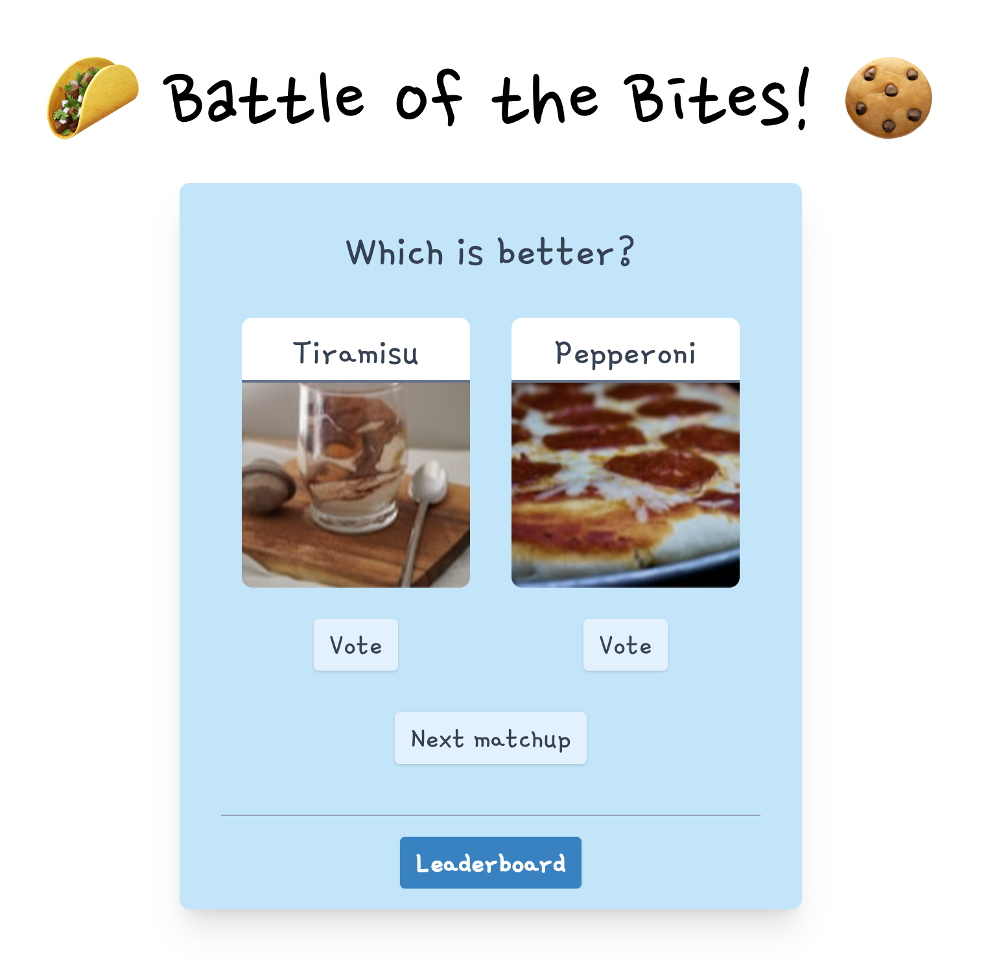

# Battle of the Bites!

***Get ready to indulge your taste buds and crown the ultimate culinary champion in Battle of the Bites!*** 🍔🍕🍣
Swipe, vote, and savor the showdown as iconic dishes from around the world go head-to-head in a gastronomic clash like no other.
Will pizza outflavor sushi?
Can burgers grill their way to victory over tacos?
Join the epic feast and help your favorite bites seize their rightful spot on the podium of delicious dominance.
Welcome to the ultimate flavor face-off!

Check out the app's demo at https://d150bm8l5c4qqp.cloudfront.net/.



Inspired by https://eloeverything.co/.

## Development

### Deployment

To deploy your own copy of the app, first make sure you have AWS credentials configured in your terminal for the account and region you want to deploy to.
Then:
1. Clone this git repository.
2. Compile the project to AWS (with Terraform) using `wing compile -t tf-aws main.w`.
3. Run `cd target/main.tfaws` to find your deployment artifacts.
4. Run `terraform init` and `terraform apply`.

### Website

1. Clone this git repository.
2. Run `cd website`.
3. Run `npm install`.
4. Create a file at `website/public/config.json` that contains the following:

```json
{
    "apiUrl": "<API GATEWAY URL>",
}
```

Replace <API GATEWAY URL> with the URL of the API Gateway that was created when you deployed the app.

5. Run `npm run start` from `website` to start the development server. Any changes you make to the website will be automatically reflected in the browser.

## Contributions

Pull requests are welcome.

## License

This project is distributed under the [MIT](./LICENSE) license.
